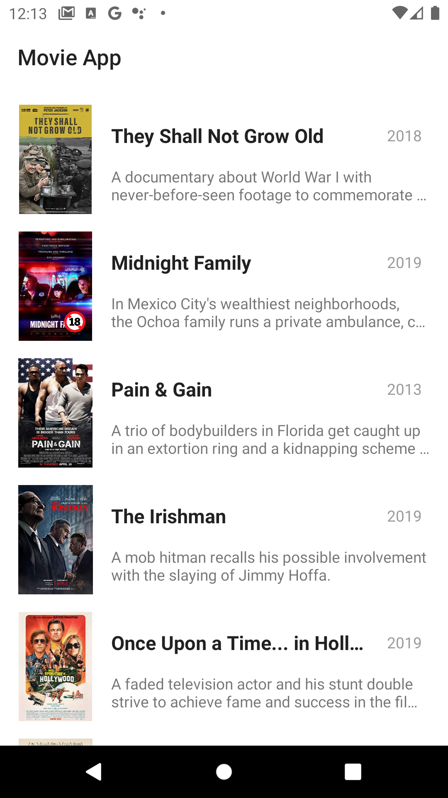

### Application which retrieves data from Webserver (via Retrofit), saves it into Room and get from it if user is offline. There are applying MVVM architecture pattern and Dagger 2 example. 

## Overview:

* ### Model
   Model is implemented as Repository pattern. Firstly it begins from internet connection checking. Consequently if it's alive we're retrieving data from the server (by using Retrofit 2) and inserting into the SQLite database. Otherwise we're trying to fetch data from the SQLite itself.
 * ### View
   View is realised as 2 fragments. First one contains RecyclerView, second one depends on clicks on recycler-items and finally displays detailed data fetched from the Model.
It implements state saving reflected on configuration changes.
* ### ViewModel
  ViewModel is responsible for transferring data between view and model.
 * ### Dagger 2
    - Implementation of dependency injection for communication between app modules
    - AndroidInjector applying for injecting into View components
    - Unit-testing simplifying

---------------

## Applied technologies and libraries: 

### Model

* #### Retrofit 2  
     * getting data from server into pojo-classes
 * #### SQLite
    * storing data fetched from server. User get data here if he is offline
* #### Coroutines
    - managing asynchronous database and network queries
    - using instead of callbacks
    - providing light asynchronous operations
 
### ViewModel
* #### LiveData
    * observer-pattern implementation for View interaction

### View
* #### Fragments
   * interactive displaying and click reflecting
* #### Data Binding
   * replace basic operations with UI (e.g. findViewById() ) to the XML

